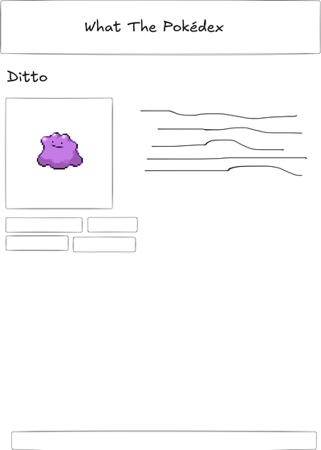

Welcome to **WHAT THE POKÉDEX**, a coding challenge to show off your frontend skills and your abilities to quickly get the hang of an unfamiliar repository.

This repository contains a bare-bones starter package to run a Next.js application locally and start coding with HMR right away.

The tech stack consists of `Next.js (14)`, `TypeScript`, `Tailwind CSS` and runs with `yarn`.

## Getting Started

First, run the development server:

```bash
nvm install && nvm use
yarn
yarn dev
```

Open [http://localhost:3000](http://localhost:3000) with your browser to see the result.

You can start editing the page by modifying `app/page.tsx`. The page auto-updates as you edit and save the file.

We've set the project up so that linting and code formatting should work out of the box when you save a file.

## Next.js Concepts

**Please read this first before diving into the tasks.**

Next.js is a powerful framework to build web applications.

We configured this repository to make use of the newest Next.js/React features:

- Next.js [App Router](https://nextjs.org/docs/app). This is important to know. If you look something up in the Next.js docs, make sure it says "Using App Router" (NOT Pages Router) in the upper left corner.
- [Server Components](https://nextjs.org/docs/app/building-your-application/rendering/server-components). This might be a tricky concept if you're new to it. The basic thing in practice for this little imaginary project is: components that have client interactions (button clicks, states or any React hook) need to be explicitly declared with a `"use client"` declaration at the top of the file. By default, all components are server components. A `page.tsx` should almost always be a server component and handle the data retrieval.
- The project is set up with [Tailwind CSS](https://tailwindcss.com/docs/utility-first). We encourage you to leverage this for styling your components and layouts

We know that this tech stack might be unfamiliar to you and you might have to do a bit of researching. This might limit how much code you can output. Don't worry about it!

This is intentional and part of the challenge. Your biggest asset in frontend development is your curiosity and love for learning new things.

## The Tasks

Build a Pokédex!

We are leveraging the public API [https://pokeapi.co/](https://pokeapi.co/) to fetch Pokémon data.

We added a few helper functions to retrieve data to get you started [here](/src/utils/pokemon-api.ts).

The project only has a very basic layout and two routes set up. Both are using the Poké API in their `page.tsx` to serve as an example.

**HINT**: You'll see that we are `console.log`ing the fetched data, but it's not showing up in your dev tools in the browser. That's because the `Page` components are server components and you'll find the log output in the terminal where you started the app with `yarn dev`.

Make a new branch in git. Open a draft PR in Github once you have accumulated a few commits.

1. On the startpage (route `/`), display a list of the first 25 pokémon that the API spits out. The list should consist of clickable elements. Bonus points if it's a nice looking grid of elements with a picture of each pokémon.
2. When you click a pokémon entry on the startpage, it should link to `/pokemon/[pokemon]`. There is a route prepared for that
3. On that page, we want to render all the details of the pokémon. It should look like a little datasheet/encylopedia entry of that pokémon. Render an image, display the type, base stats, etc. It doesn't need to be _all_ the details. Just enough to make it look like a fun Pokédex entry.




These are the basic tasks to show that you can navigate an unfamiliar repository, you know basic layouting and how to work with an API.

In your remaining time, show us what else you can do. Here is a list of things that would impress us:

- Responsive design. Make your layouts look good for small and large viewports
- Accessibility: Make sure screen readers can understand your markup and use semantic HTML.
- Fancy UI styling: Are you a CSS wizard and love to make the UI fun to use with animations, transitions and cool hover effects? Show us!
- Search page: you're a React ninja and building an interactive input to search for specific pokémon is your weird flex? Go for it.
- Pagination: Gotta show 'em all. On the startpage, add a button to show the next 25 entries, and then the next, and the next, ...
- Filter by type: You're a pro data mangler and filtering a list of Pokémon by type is a piece of cake for you.
- Let me have a collection of Pokémon. Let me mark a Pokémon as "caught" and give me a page where I can see my collection (hint: local storage).
- ... some other creative idea we didn't even think of.

**Play to your strengths**. This project doesn't have to be feature complete.

We want to see enough code to judge your coding style, how you organize code and how you structure your work. Feel free to make this _your_ codebase.

Please limit yourself to **6 hours** of actual coding time (for your own good).

We don't want you to spend more of your free time. We value well organized and thought-out code more than the amount of lines of code and features.

## What happens next?

Once you're done with your challenge, just push your latest commit and mark the PR as "Ready for Review" in Github. Please finish 2 working days before your on-site interview so that we have enough time to review your code.

When you visit us in our office, there will be a 90 minute pair programming session with one or two of our devs. We will use your PR as a basis for the session. We will ask you about your code and implementation decisions. We will also ask you to build 1 or 2 more features in this codebase.

We don't expect you to deliver perfect code on the spot. We aim to have a "natural" pairing session and we'll discover the solutions together. The purpose of this pairing session will be to get to know you professionally, how you think and approach problems and how you collaborate.

### Improvements

Fix shift in layout when interacting with the search input field 😓
Styling of the pokemon details page
